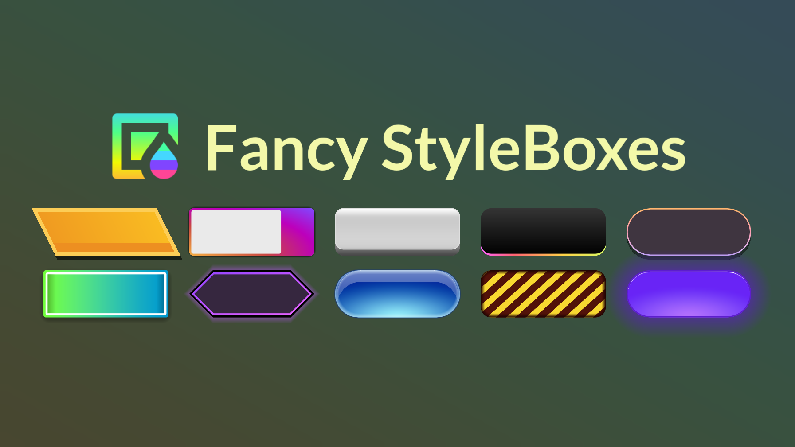
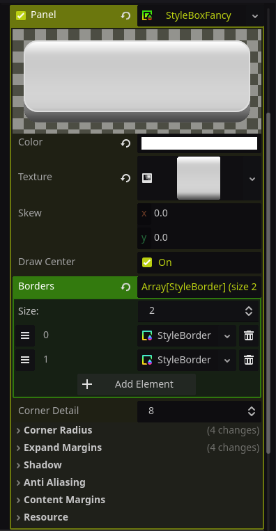
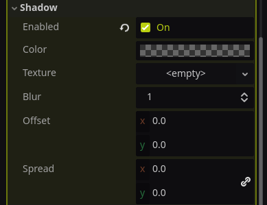
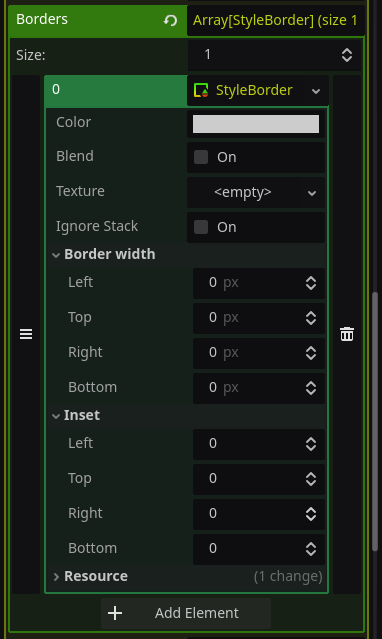

# Fancy Styleboxes
A plugin for Godot that allows for more complex and visually atractive panel designs without creating textures.

## Why does this exist?
There were several occasions where I wanted to create panel designs that sounded quite trivial, like a gradient with rounded corners, but it was impossible to do with either `StyleBoxFlat` or `StyleBoxTexture`. I found myself having to look for alternatives, such as creating a specific texture, using shaders, creating nodes with clip children, or manually drawing my nodes. Each of these options had its drawbacks, so I created my own StyleBox seeking to expand `StyleBoxFlat` functionality to make it a much more flexible tool. 

The key points of this plugin are:
* Rounded panels with texture
* Border textures
* Stackable borders

This plugin seeks to fill the gap between Godot's `StyleBoxFlat` and `StyleBoxTexture`.

## Requierements
The minimum Godot version required is 4.4

## Usage

StyleBoxFancy comes with similar properties as StyleBoxFlat such as:
* `Color`
* `Skew`
* `Corner radius` / `Corner detail`
* `Expand margins`
* `Shadow`
* `Antialiasing`

The new features are:

### Texture
Allows you to apply a `Texture2D` to your panel, it is compatible with rounded corners and antialiasing. A common use for this is creating a rounded panel with a `GradientTexture2D` which is not possible using Godot's StyleBoxes.

If a texture is set its color will be modulated by the `color` property, so if you don't want to modify the texture's color then set `color` to white.

### Shadow

Shadow has a dedicated `enabled` property that allows using shadows with 0 `size`, aka without blur.

The `scale` property allows you to scale the shadow compared to its original panel size.

> [!WARNING]
> `scale` has inconsistent position and corner radius.

## Borders

`StyleBoxFancy` implements borders as a list of `StyleBorder` so you can have more than 1 border, each `StyleBorder` has its own properties and are drawn stacked one on top of another. It includes the same properties as `StyleBoxFlat`'s border.

### Texture
Allows you to apply a `Texture2D` to your border.

If a texture is set its color will be modulated by the `color` property, so if you don't want to modify the texture's color then set `color` to white.

### Ignore stack
By default borders will stack so each border is moved inwards, by enabling this property it will be drawn as it were the top border regardless of its position on the list, and it will not interact with other borders.

### Inset
Allows you to move each side of the border inwards leaving an empty area behind, it can also be moved outwards with a negative value.

## Performance
Compared to `StyleBoxFlat` it is about 10~ times slower, mainly due to it being written in GDScript and not C++

This is not a problem for a majority of use cases, only games with lots of UI or constant animations may have to consider this.

> [!NOTE]
> Tested with 1000 panels constantly being redrawn each frame with both StyleBoxes having a border and antialiasing on, using Godot's profiler measuring Frame Time (ms).
> * StyleBoxFlat: **34.24 ms**
> * StyleBoxFancy: **342.66 ms**

## Instalation
### Asset library (Not available yet)
* In your godot project open the AssetLib tab on the top and search for "Fancy StyleBoxes".
* Download and install into your addons folder.
* Enable the plugin in `Project/Project Settings/Plugins`.

### Manual install
* Download the latest release [here](https://github.com/xZpookyx/StyleBoxFancy/releases).
* Inside the zip file should be an "addons" folder, uncompress it and move it to your project root folder.
* Enable the plugin in `Project/Project Settings/Plugins`.
